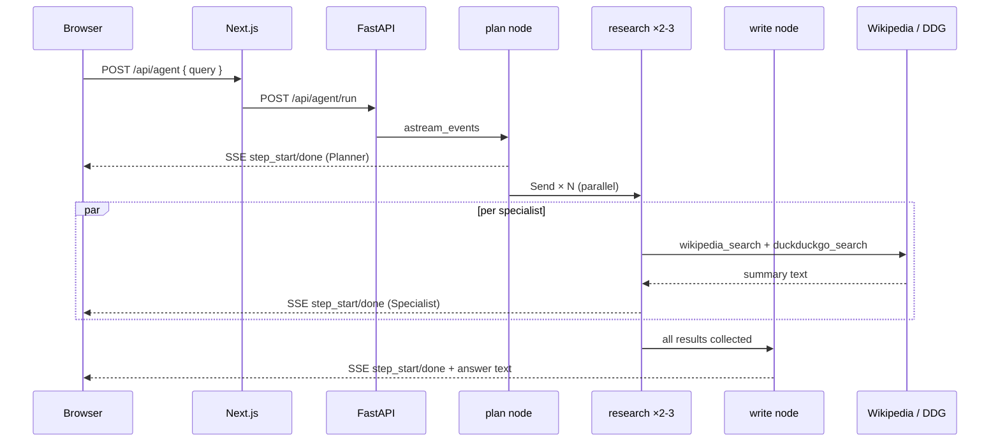
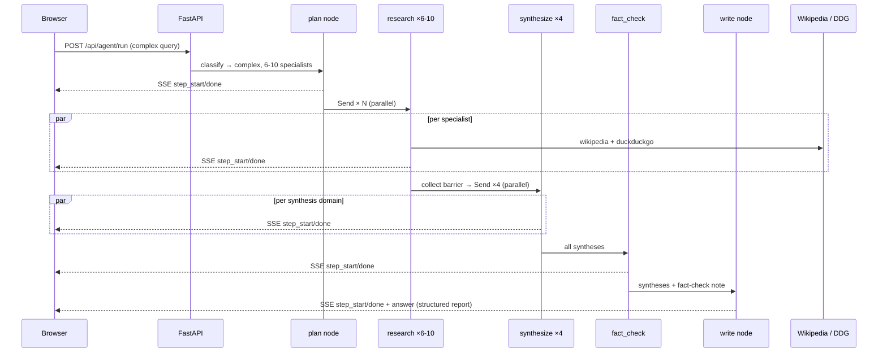

# Multi-Agent Orchestration — LangGraph · MCP Server · FastAPI SSE · GCP

**LangGraph** state machine with live reasoning visibility: a `plan` node routes simple queries through
2–3 parallel specialist researchers and complex queries through up to 10, then fans them through 4 parallel
domain synthesizers and a fact-check node before producing a structured report. Every graph step streams to
the browser as SSE events so you can watch the agent pipeline execute in real time. The same tools are also
exposed as an **MCP server** over stdio — connectable from Claude Desktop, Claude Code, or any MCP-compatible client.

**[→ Portfolio demo](https://bganguly.github.io/#multi_agent)**

---

## Using the App

### Single-turn queries

Type any research question. The `plan` node classifies it as simple or complex and dispatches the right
number of specialist researchers automatically.

Good starting points:

- *"What is quantitative easing?"* — simple path, 2–3 researchers, fast answer
- *"Compare fiscal policy and monetary policy approaches to recession."* — complex path, full pipeline with synthesis and fact-check
- *"What are the ethical and regulatory implications of AI in healthcare?"* — complex multi-domain, triggers clinical + regulatory + ethics + societal synthesis

Watch the **StepTracker** panel: each node transitions from pending → active (⟳) → done (✓) with a word-count
or detail line as it completes. The final answer streams in after all steps finish.

### Sustained multi-turn conversation

Each `/api/agent/run` call is **stateless** — the graph starts fresh with no memory of prior queries.
To build on a prior answer, you must carry context forward in the question itself.

**Patterns that work well across turns:**

| What you want | How to phrase it |
|:--|:--|
| Drill deeper into a prior answer | *"Explain the transmission mechanism of quantitative easing in more detail."* |
| Compare to something mentioned | *"Compare the economic impact of QE to that of direct fiscal stimulus."* |
| Add a dimension the first answer missed | *"Now cover the geopolitical and regulatory implications of QE."* |
| Chain topics from a prior run | *"Following from QE, how does Modern Monetary Theory differ in its approach?"* |
| Narrow from broad to specific | *"From the competitive landscape of electric vehicles, focus only on battery supply chain risks."* |

**Practical tips:**

- **Simple vs. complex routing is automatic** — the `plan` node reads query complexity from the LLM. Single-topic factual questions get 2–3 researchers; multi-part comparative or policy questions get 6–10. Phrasing matters: *"What is X?"* routes simple; *"Compare X and Y across clinical, economic, and policy dimensions"* routes complex.
- **The full pipeline takes ~30–60 s for complex queries** — 10 parallel researcher calls + 4 synthesizer calls + fact-check + write. Simple queries complete in ~5–10 s.
- **Specialists are fixed** — the 10 specialist lenses (clinical, economics, regulatory, technology, ethics, historical, competitive, scientific, consumer, geopolitical) are always available. The planner picks the most relevant subset. If you want a specific lens included, name it explicitly: *"Include an ethical analysis of…"*
- **MCP path for true multi-turn** — connect `app/mcp/server.py` to Claude Desktop or Claude Code. Claude's own chat history then provides turn-to-turn context; it calls `wikipedia_search` and `duckduckgo_search` on demand. This is the best path for iterative deep-dives without losing prior context.
- **StepTracker as a debug signal** — if a researcher step completes with very few words (e.g., "12 words retrieved"), Wikipedia returned no article for that specialist's search query. Rephrase the next query with more common terminology to get better retrieval.

---

## Running

```bash
./scripts/deploy.sh      # local [1] or GCP Cloud Run / GKE [2]
./scripts/infra-down.sh  # stop local [1] or delete Cloud Run services [--cloud]
```

Prerequisites for local: Python 3.12+, Node 20+. Copy `.env.example` → `.env` and fill in `ANTHROPIC_API_KEY`.
Local Redis: `brew install redis && brew services start redis`, then set `REDIS_URL=redis://localhost:6379` in `.env`.

Cloud Run deploy requires `gcloud` CLI authenticated (`gcloud auth login`) with a project set.

---

| Component | Implementation |
|---|---|
| **Orchestration** | LangGraph `StateGraph` with conditional edges; `Send` API for parallel fan-out to N `research` nodes and 4 `synthesize` nodes |
| **Agent graph (simple)** | `plan` → `research` ×2–3 (parallel) → `collect` → `write` |
| **Agent graph (complex)** | `plan` → `research` ×6–10 (parallel) → `collect` → `synthesize` ×4 (parallel) → `fact_check` → `write` |
| **Specialists** | 10 lenses: Clinical, Economics, Regulatory, Technology, Ethics, Historical, Competitive, Scientific, Consumer, Geopolitical — planner selects the relevant subset per query |
| **Synthesis domains** | 4 parallel synthesizers: Clinical & Scientific · Business & Economic · Policy & Regulatory · Societal Impact |
| **Tools** | `wikipedia_search` (Wikipedia REST summary API) · `duckduckgo_search` (DuckDuckGo Instant Answers) — no API key required |
| **MCP server** | `app/mcp/server.py` exposes both tools over stdio using the `mcp` Python SDK; connects to Claude Desktop / Claude Code via `claude_desktop_config.json` |
| **LLM** | `claude-3-5-haiku-20241022` for all nodes (plan, research, synthesize, fact_check, write) |
| **Streaming** | FastAPI `StreamingResponse` emits SSE: `step_start`, `step_done` (with detail), `answer`; Next.js API route proxies stream to browser |
| **Step visibility** | `StepTracker` component renders each node live: pending → active (⟳) → done (✓) with detail text; `AgentGraph` renders the graph topology |
| **Session state** | Redis 7 (`redis:7-alpine`) on `:6381` via Docker Compose — used for session coordination between frontend and backend |
| **Backend** | FastAPI 0.115 + asyncio; `graph.astream_events(version="v2")` drives the SSE stream |
| **Frontend** | Next.js 15 App Router, React 19, TypeScript 5.7, Tailwind CSS; custom SSE consumer; deployed on GCP |
| **IaC** | Terraform (`infra/aws/`) for ECS Fargate; `k8s/` manifests for GKE; `cloudbuild-gke.yaml` for Cloud Build |

---

## Architecture

### Simple flow — step by step

1. **Browser → Next.js → FastAPI** — `POST /api/agent/run { query }` arrives; the graph is initialized with a fresh empty state (no prior history).
2. **`plan` node** — LLM classifies the query as `"simple"` and selects 2–3 specialist keys; emits `step_start` / `step_done` SSE events.
3. **`research` nodes (parallel)** — `Send` API fans out one `research` invocation per selected specialist; each specialist appends its focus keywords to the query, calls `wikipedia_search` + `duckduckgo_search`, and returns the combined text; `step_start` / `step_done` events arrive as each researcher completes.
4. **`collect` node (barrier)** — silent synchronization point; waits for all parallel `research` branches to complete before proceeding; emits no UI events.
5. **`write` node** — LLM receives all research results concatenated, writes a concise answer; `answer` SSE event streams the text to the browser.



### Complex flow — step by step

Steps 1–4 are identical to the simple flow, with 6–10 specialists instead of 2–3. After `collect`:

5. **`synthesize` nodes ×4 (parallel)** — `Send` fans out one synthesizer per domain (Clinical & Scientific, Business & Economic, Policy & Regulatory, Societal Impact); each reads only the research results from its relevant specialist subset and writes a 2–3 paragraph domain summary.
6. **`fact_check` node** — LLM reviews all four synthesis outputs for contradictions or unsupported claims; flags issues in 2–3 sentences.
7. **`write` node** — LLM receives the four domain syntheses plus the fact-check note, produces a structured `##`-headed report; `answer` event streams the full report.



### Key design decisions

| Concern | Approach |
|:--|:--|
| **Stateless per query** | No session history is threaded through the graph — each `POST /api/agent/run` starts from an empty `AgentState`. Multi-turn continuity must be carried in the query text, or handled externally (MCP path gives Claude its own chat history) |
| **Parallel fan-out** | LangGraph `Send` API spawns N independent `research` nodes in the same graph execution; LangGraph's reducer (`operator.add` on lists) merges their results at the `collect` barrier without locking |
| **Complexity routing** | The `plan` node outputs a `"complexity"` field; `route_after_collect` reads it to decide whether to fan out to `synthesize` or jump directly to `write` — a single conditional edge covers both paths |
| **Specialist focus injection** | Each researcher appends its domain focus string (e.g., `"economic impact market size cost analysis"`) to the raw query before searching — improves retrieval specificity without separate embedding logic |
| **No LLM caching** | Results should reflect the actual query each time; the same question about a topic that changed in Wikipedia should return fresh information |
| **MCP reuse** | `app/mcp/server.py` wraps the same `wikipedia_search` and `duckduckgo_search` functions used by the graph nodes — one implementation, two entry points (graph + MCP) |
| **`collect` as a hidden barrier** | The `collect` node is listed in `HIDDEN_NODES` in the route handler and emits no SSE events — it exists purely to let LangGraph synchronize parallel branches before the conditional edge fires |

---

## MCP Server (Claude Desktop / Claude Code)

Add to `~/.claude/claude_desktop_config.json`:

```json
{
  "mcpServers": {
    "agent-tools": {
      "command": "python",
      "args": ["-m", "app.mcp.server"],
      "cwd": "/path/to/agent-orchestration-demo/backend",
      "env": { "ANTHROPIC_API_KEY": "sk-ant-..." }
    }
  }
}
```

Restart Claude Desktop — `wikipedia_search` and `duckduckgo_search` appear in the tool list.
Claude's native chat history provides multi-turn context; the tools are called on demand per turn.

---

## Quick Test — Local

```bash
curl http://localhost:8002/health
```

```bash
curl -X POST http://localhost:8002/api/agent/run \
  -H "Content-Type: application/json" \
  -d '{"query": "What is quantitative easing?"}' \
  --no-buffer
```

```bash
curl -X POST http://localhost:8002/api/agent/run \
  -H "Content-Type: application/json" \
  -d '{"query": "Compare fiscal policy and monetary policy approaches to recession."}' \
  --no-buffer
```

---

## Live Services

> **Schedule:** ECS Fargate runs weekdays 8 am – 5 pm PT. Outside those hours the app is offline — [request access](https://bganguly.github.io/#multi_agent) for off-hours access.

| Service | Local | Cloud Run |
|---|---|---|
| Next.js app | http://localhost:3011 | https://agent-frontend-77y7e2wykq-uc.a.run.app |
| FastAPI docs | http://localhost:8002/docs | https://agent-backend-77y7e2wykq-uc.a.run.app/docs |
